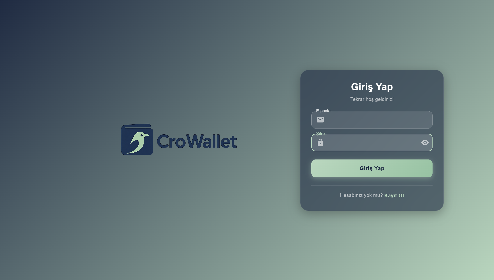
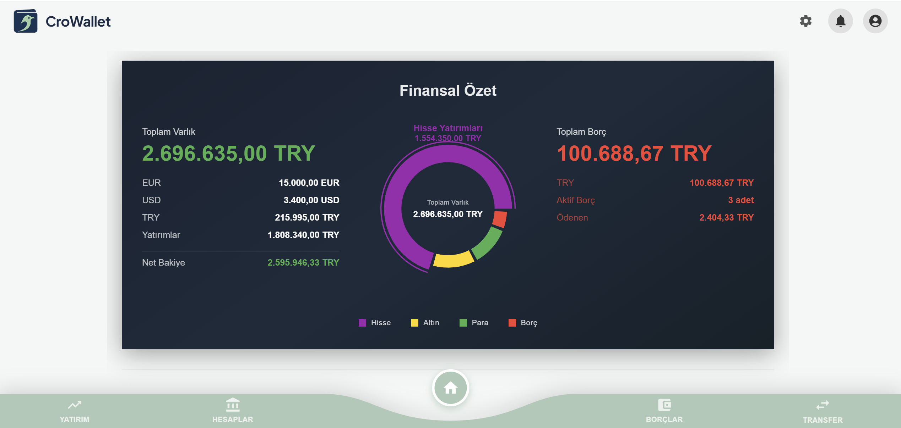
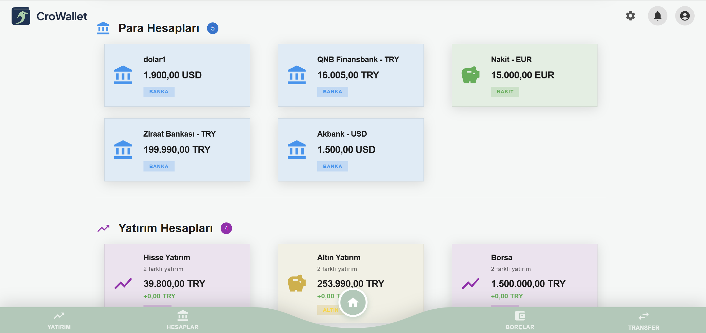
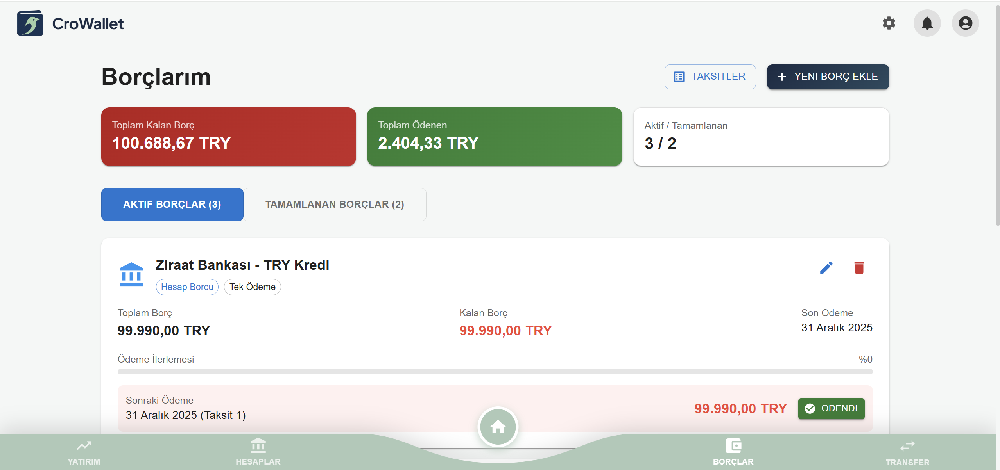
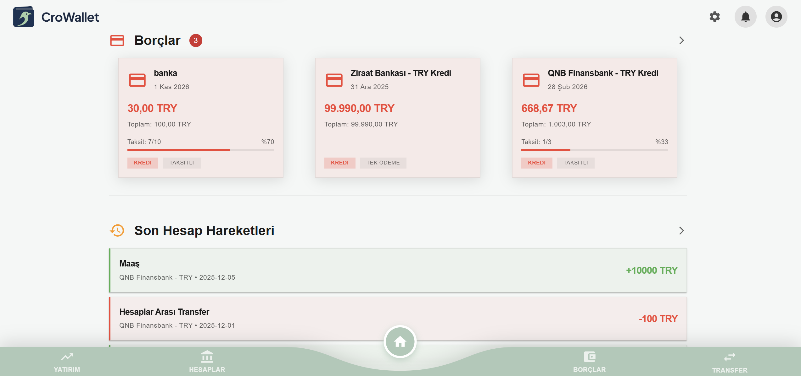
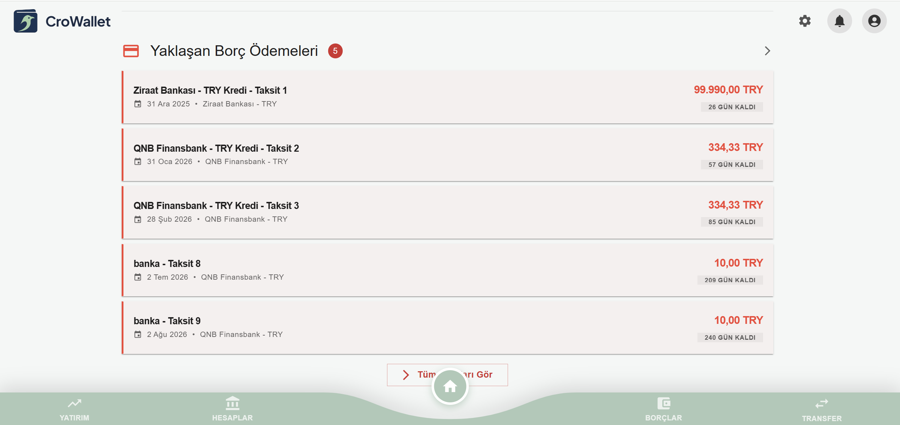
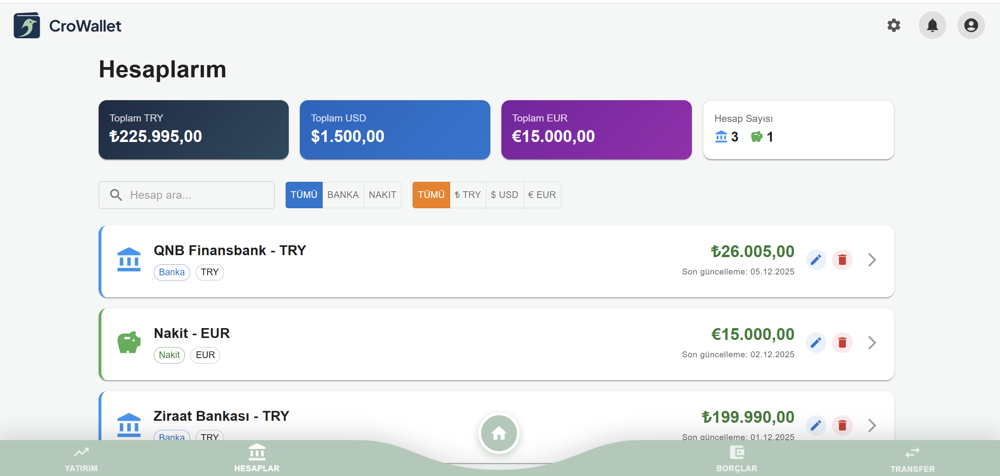
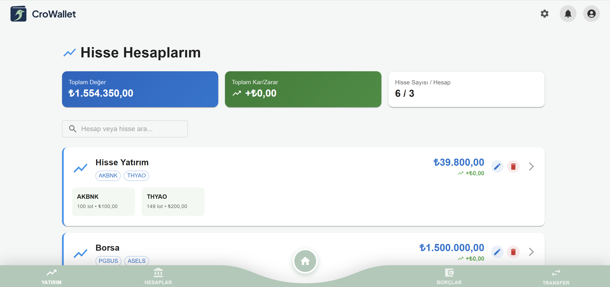
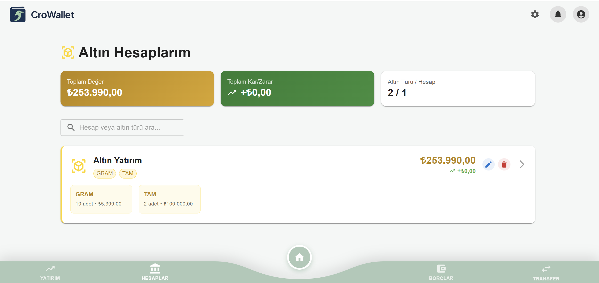
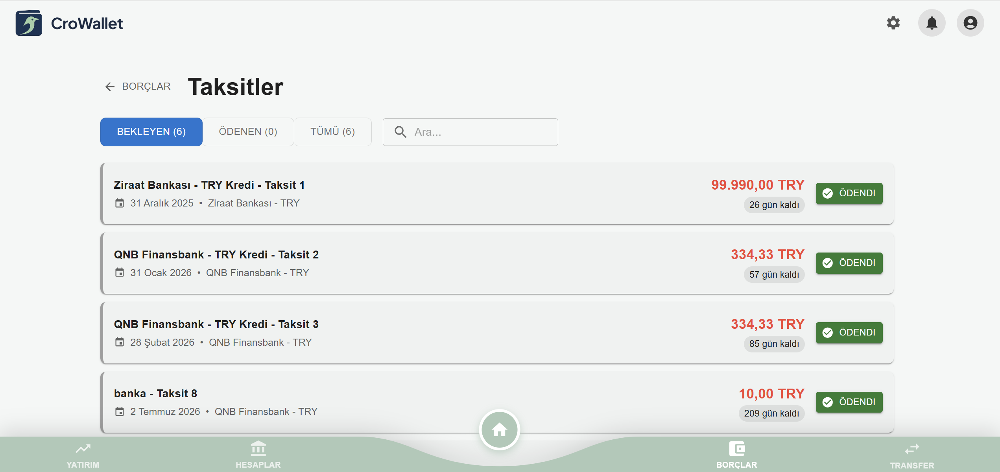

<h1 id="top" align="center">CroWallet</h1>

## 🔍 Table of Contents

- [About Project](#intro)
- [Technologies](#technologies)
- [Features](#features)
- [System Startup](#system-startup)
- [Architecture Overview](#architecture-overview)
- [Screenshots](#screenshots)
- [Contributors](#contributors)

<h2 id="intro">📌 About Project</h2>

CroWallet is a modular full-stack personal finance manager built with React + Vite, Spring Boot, and PostgreSQL. It empowers users with real-time control over accounts, transfers, debts, and notifications. Designed for clarity and responsiveness, CroWallet is ideal for portfolio showcasing or as a foundation for a scalable finance platform.

<h2 id="technologies">☄️ Technologies</h2>
- Java Spring Boot
- React Vite
- Docker

<br/>

<h2 id="features">🔥 Features</h2>

Account Management: Create and edit accounts with real-time balance tracking and manual adjustment logs.

Multi-Type Transfers: Handle income, expenses, and inter-account transfers with intuitive currency support.

Debt Tracking: Schedule debts, receive due-date alerts, and get notified about upcoming payments.

Transaction History: Filterable and searchable transaction logs for full financial transparency.

Real-Time Notifications: Stay informed with alerts for debts, thresholds, and system events.

Responsive UI: Optimized for both desktop and mobile with reusable global components.

Custom Categories: Define your own income and expense categories for personalized tracking.

Docker-Ready: Easily deployable with Docker Compose for local development and production.

<br/>

<h2 id="system-startup">🚀 System Startup</h2>

Clone the repository.
```
git clone https://github.com/yourusername/crowallet
cd crowallet
```
Create `.env` files for frontend and backend based on provided examples.
```
cp backend/.env.example backend/.env
cp frontend/.env.example frontend/.env
```
Start services with Docker Compose.
```
docker compose up --build
```
<br/>
Alternatively, you can run PostgreSQL and pgAdmin manually via Docker: 

```
docker run --name postgres-db -e POSTGRES_PASSWORD=yourpassword -p 5432:5432 -d postgres docker run --name pgadmin -p 5050:80 -e PGADMIN_DEFAULT_EMAIL=admin@admin.com -e PGADMIN_DEFAULT_PASSWORD=admin -d dpage/pgadmin4
```

Then,

- Run `ApiApplication.java` from your IDE
- Start the frontend:

```
  cd frontend
  npm run dev
```

<h2 id="screenshots">📸 Screenshots</h2>

<div align="center">
    
    <br><br>
    
    <br><br>
    
    <br><br>
    
    <br><br>
    
    <br><br>
    
    <br><br>
    
    <br><br>
    
    <br><br>
    
    <br><br>
    
</div>

<h2 id="architecture-overview">🏗️ Architecture Overview</h2>

CroWallet follows a modular architecture:

- **Frontend:** React + Vite SPA served via Docker
- **Backend:** Java Spring Boot REST API
- **Database:** PostgreSQL with JPA/Hibernate
- **Deployment:** Docker Compose orchestrates all services

<h2 id="contributors">👥 Contributors</h2>

<a href="https://github.com/AybarsKansu" target="_blank"></a> 
<a href="https://github.com/durukaracan" target="_blank"></a>
