<h1 id="top" align="center">CroWallet</h1>

<br>

<div align="center">
    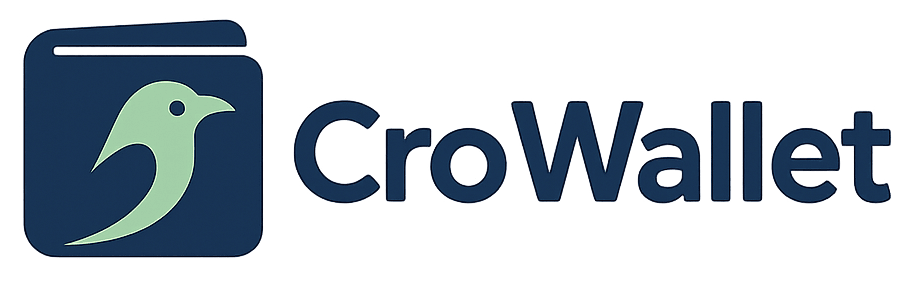
</div>

## 🔍 Table of Contents

- [About Project](#intro)
- [Technologies](#technologies)
- [Features](#features)
- [System Startup](#system-startup)
- [Mobile Access](#mobile-access)
- [Architecture Overview](#architecture-overview)
- [Screenshots](#screenshots)
- [Contributors](#contributors)

<br/>

<h2 id="intro">📌 About Project</h2>

CroWallet is a modular full-stack personal finance manager built with React + Vite, Spring Boot, and SQLite. It empowers users with real-time control over accounts, transfers, debts, and notifications. Designed for clarity and responsiveness, CroWallet is ideal for portfolio showcasing or as a foundation for a scalable finance platform.

<br/>

<h2 id="technologies">☄️ Technologies</h2>

- 🧠 **Java Spring Boot** – Powerful backend framework for building RESTful APIs
- ⚡ **React + Vite** – Lightning-fast frontend development with modern tooling
- 📦 **Docker** – Seamless containerization for development and deployment

<br/>

<h2 id="features">🔥 Features</h2>

**Account Management**: Create and edit accounts with real-time balance tracking and manual adjustment logs.

**Multi-Type Transfers**: Handle income, expenses, and inter-account transfers with intuitive currency support.

**Debt Tracking**: Schedule debts, receive due-date alerts, and get notified about upcoming payments.

**Transaction History**: Filterable and searchable transaction logs for full financial transparency.

**Real-Time Notifications**: Stay informed with alerts for debts, thresholds, and system events.

**Responsive UI**: Optimized for both desktop and mobile with reusable global components.

**Custom Categories**: Define your own income and expense categories for personalized tracking.

**Docker-Ready**: Easily deployable with Docker Compose for local development and production. **Fully accessible from mobile phones** via Wi-Fi, Tailscale VPN, or ngrok tunneling.

**Environment Variables:** Support for environment variables to manage configurations.

<h3> Todo </h3>

<a href="./todo.md">Todo Details</a>

<br/>

<h2 id="system-startup">🚀 System Startup</h2>

### 🔧 Quick Start

Clone the repository.

```
git clone https://github.com/fhanci/crowallet
cd crowallet
```

Configure environment variables.

```
cp frontend/.env.example frontend/.env
```

Start services with Docker Compose.

```
docker compose up --build
```

This method is ideal for quickly starting and testing the application.

### 🛠️ Development Setup (Recommended for Contributors)

However, if you plan to contribute or develop features, it's recommended to set up the environment manually:

Start the SQLite web interface:

```
docker run --name sqlite-web -p 8080:8080 -v $(pwd)/data:/data ghcr.io/coleifer/sqlite-web:latest /data/database.db
```

Then,

- Run `ApiApplication.java` from your IDE
- Launch the frontend:

```
  cd frontend
  cp .env.example .env
  npm install
  npm run dev
```

This setup gives you more flexibility during development and makes debugging easier.

<br/>

<h2 id="mobile-access">Mobile Access</h2>

After starting the application with Docker Compose, you can access CroWallet from your mobile phone using one of the following methods:

### Option 1: Same Wi-Fi Network

**Requirements:** Your phone and PC must be on the same Wi-Fi network.

1. **Find your PC's IP address:**
   - Windows: Run `ipconfig` in Command Prompt
   - Look for "IPv4 Address" under your active Wi-Fi/Ethernet adapter
   - Example: `192.168.1.100` or `10.26.253.109`

2. **Open Windows Firewall for port 3000:**
   ```powershell
   # Run PowerShell as Administrator
   New-NetFirewallRule -DisplayName "CroWallet Frontend" -Direction Inbound -LocalPort 3000 -Protocol TCP -Action Allow
   New-NetFirewallRule -DisplayName "CroWallet Backend" -Direction Inbound -LocalPort 8082 -Protocol TCP -Action Allow
   ```

3. **Access from your phone:**
   - Open browser on your phone
   - Navigate to: `http://YOUR_PC_IP:3000`
   - Example: `http://192.168.1.100:3000`

**Troubleshooting:**
- Ensure both devices are on the same Wi-Fi (not guest network)
- Temporarily disable Windows Firewall to test if it's blocking
- Check if your router has "AP Isolation" enabled (disable it)

---

### Option 2: Mobile Data/4G/5G with Tailscale (Recommended for Persistent Access)

**Requirements:** Tailscale account (free).

1. **Install Tailscale on your PC:**
   - Download from: https://tailscale.com/download/windows
   - Sign in with Google/Microsoft/GitHub account

2. **Install Tailscale on your phone:**
   - Download from Play Store (Android) or App Store (iOS)
   - Sign in with the **same account**

3. **Get your PC's Tailscale IP:**
   ```powershell
   tailscale ip -4
   ```
   You'll get an IP like `100.x.x.x`

4. **Access from your phone:**
   - Ensure Tailscale is connected on your phone
   - Open browser: `http://100.x.x.x:3000` (use your PC's Tailscale IP)

**Benefits:**
- Works on any network (Wi-Fi, 4G, 5G)
- Completely private and encrypted
- IP address never changes
- No connection limits

---

### Option 3: Mobile Data/4G/5G with ngrok

**Requirements:** ngrok account (free).

1. **Sign up and get auth token:**
   - Go to https://ngrok.com/signup
   - Copy your auth token from https://dashboard.ngrok.com/get-started/your-authtoken

2. **Install ngrok:**
   - Download from: https://ngrok.com/download
   - Extract and move `ngrok.exe` to `C:\Windows\System32`

3. **Authenticate ngrok:**
   ```bash
   ngrok config add-authtoken YOUR_AUTH_TOKEN
   ```

4. **Start the tunnel:**
   ```bash
   ngrok http 3000
   ```

5. **Access from your phone:**
   - Copy the `Forwarding` URL from ngrok output (e.g., `https://abc123.ngrok-free.app`)
   - Open that URL in your phone browser
   - Click "Visit Site" on the ngrok warning page

<br/>

<h2 id="screenshots">📸 Screenshots</h2>

<div align="center">
    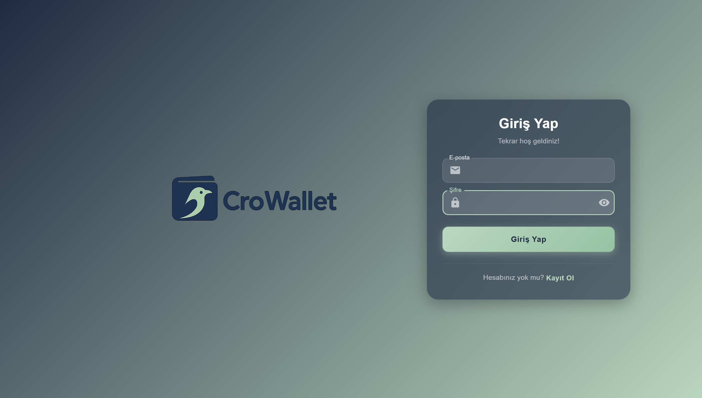
    <br><br>
    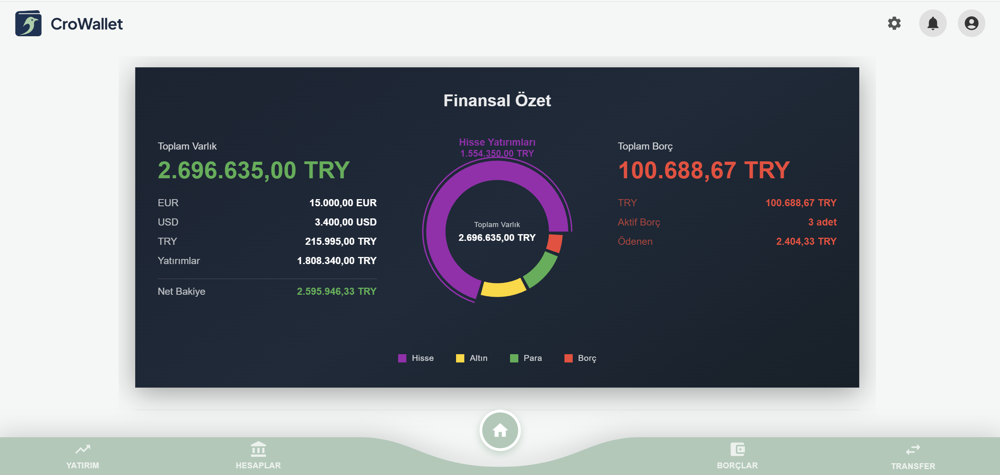
    <br><br>
    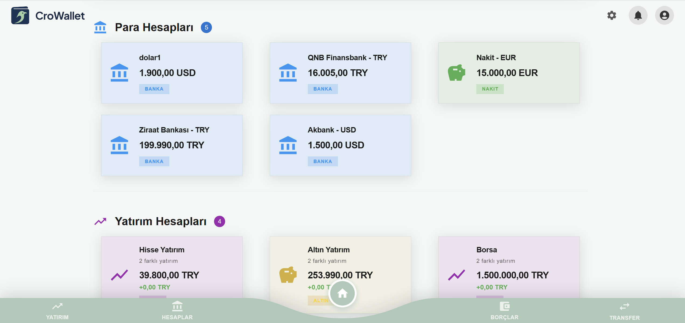
    <br><br>
    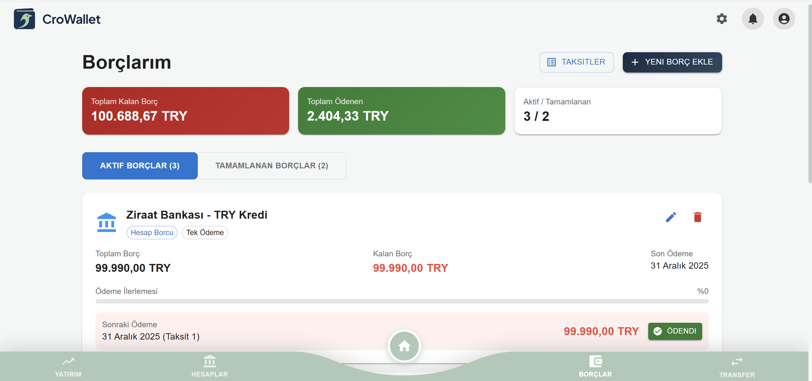
    <br><br>
    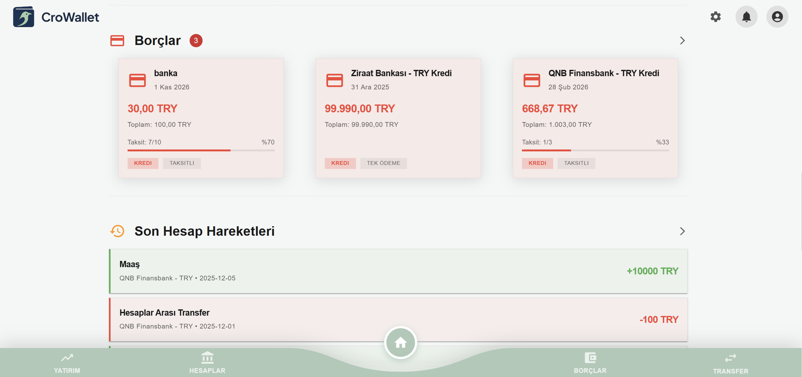
    <br><br>
    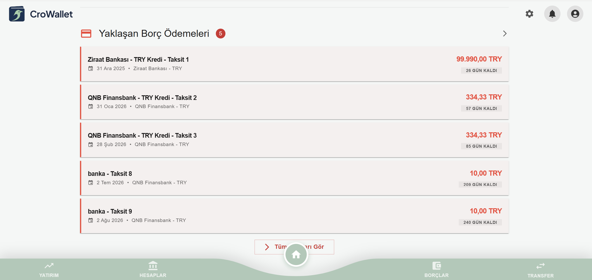
    <br><br>
    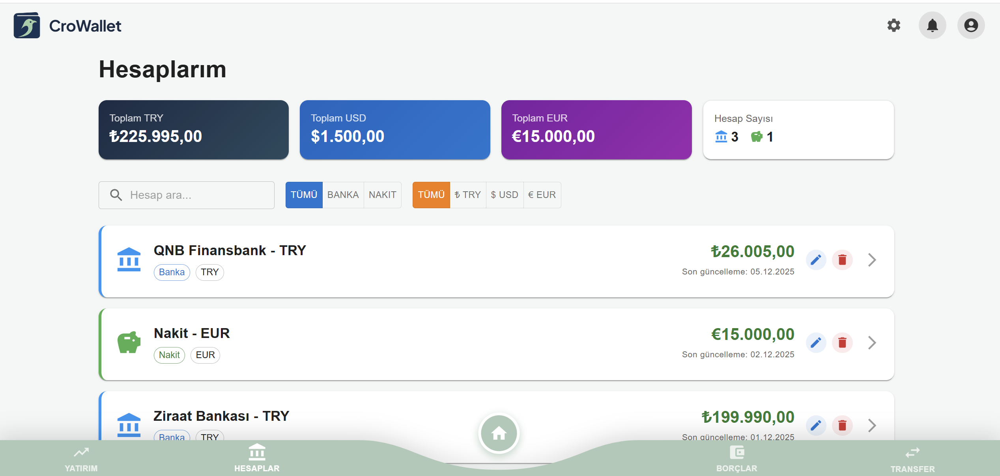
    <br><br>
    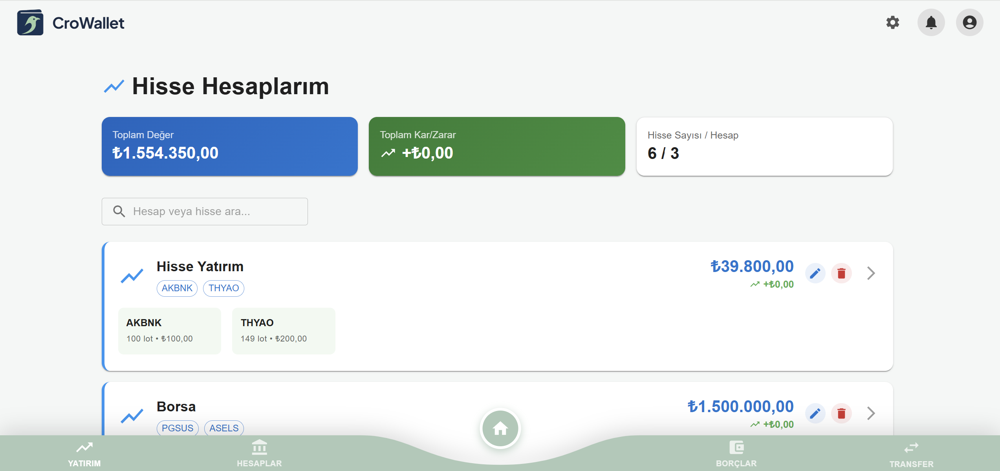
    <br><br>
    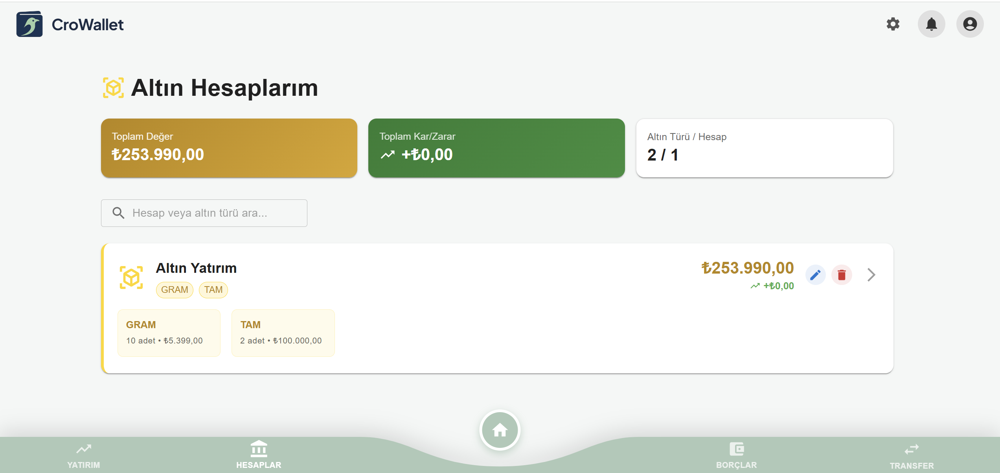
    <br><br>
    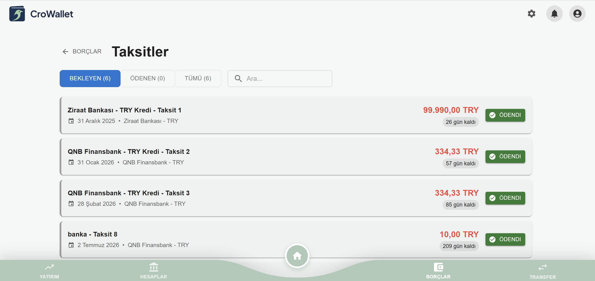
</div>

<br/>

<h2 id="architecture-overview">🏗️ Architecture Overview</h2>

CroWallet follows a modular architecture:

- **Frontend:** React + Vite SPA served via Nginx with reverse proxy to backend
- **Backend:** Java Spring Boot REST API with CORS enabled for cross-origin access
- **Database:** SQLite with JPA/Hibernate
- **Deployment:** Docker Compose orchestrates all services
- **Networking:** Nginx reverse proxy enables seamless mobile access from any network

**Mobile-Ready Architecture:** The Nginx reverse proxy consolidates frontend and backend under a single origin, eliminating CORS issues and enabling access from Wi-Fi, mobile data (4G/5G), or VPN connections.

<br/>

<h2 id="contributors">👥 Contributors</h2>

<a href="https://github.com/AybarsKansu" target="_blank"></a>
<a href="https://github.com/durukaracan" target="_blank"></a>
<a href="https://github.com/canakpinar315" target="_blank"></a>
<a href="https://github.com/ahmettoguz" target="_blank"></a>
<a href="https://github.com/fhanci" target="_blank"></a>

[🔝](#top)
